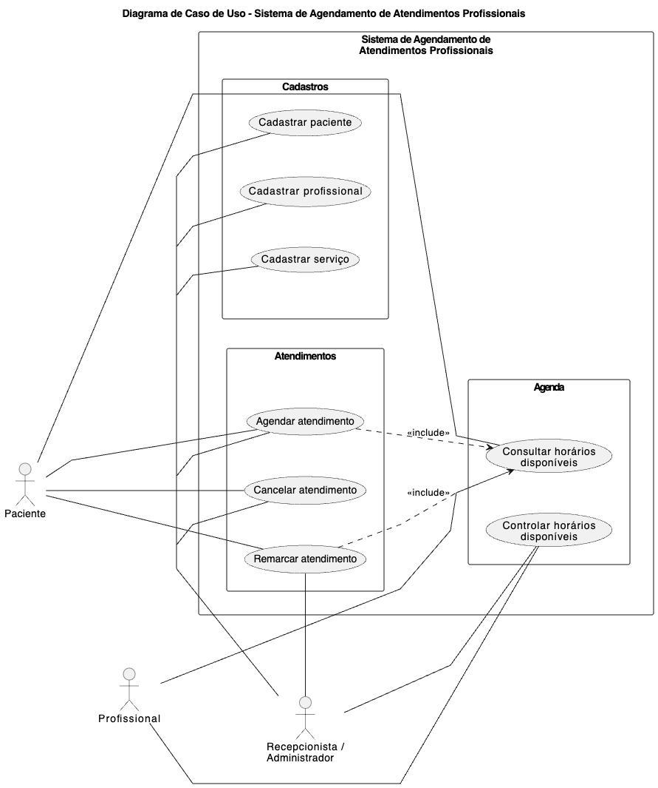
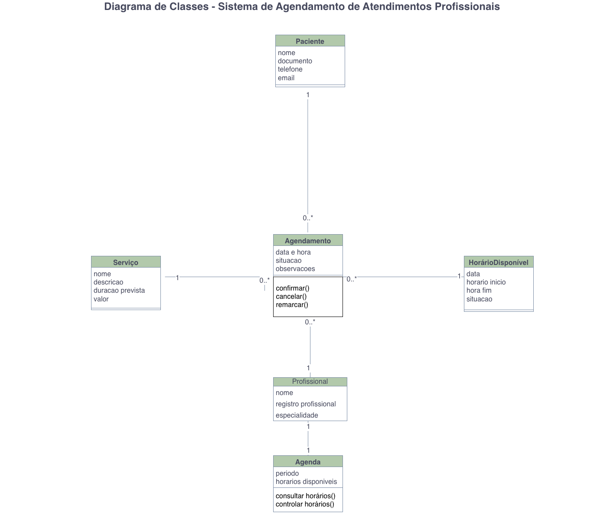
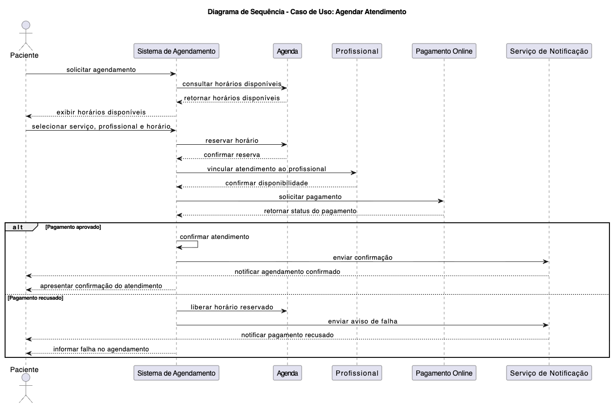
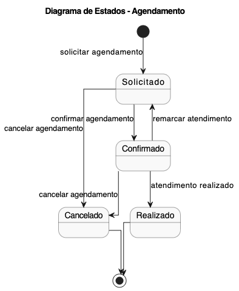

# Sistema de Agendamento de Atendimentos Profissionais

## Descrição do Projeto

Este projeto apresenta a modelagem de um Sistema de Agendamento de Atendimentos Profissionais, desenvolvido como trabalho acadêmico utilizando conceitos de UML e modelagem de software.

O sistema foi pensado para atender clínicas, consultórios e serviços especializados, auxiliando no controle de horários, organização de agendas e gerenciamento de atendimentos.

---

# Visão do Problema

Muitos atendimentos ainda são gerenciados de forma manual ou pouco estruturada, gerando problemas como:

- conflito de horários;
- falta de controle da agenda;
- dificuldade na gestão de atendimentos.

O sistema proposto busca organizar o processo de agendamento e melhorar o controle das informações relacionadas aos atendimentos.

---

# Funcionalidades Principais

- Cadastro de pacientes;
- Cadastro de profissionais;
- Cadastro de serviços;
- Agendamento de atendimentos;
- Cancelamento e remarcação;
- Controle de horários disponíveis.

---

# Diagrama de Caso de Uso

O diagrama de caso de uso apresenta as principais funcionalidades do Sistema de Agendamento de Atendimentos Profissionais, considerando o contexto de clínicas, consultórios e serviços especializados.

O sistema possui três atores principais: Paciente, Profissional e Recepcionista/Administrador. O Paciente pode consultar horários disponíveis, agendar atendimentos, cancelar atendimentos e remarcar atendimentos. O Profissional pode consultar e controlar os horários disponíveis relacionados à sua agenda de atendimento. Já o Recepcionista/Administrador possui acesso às funções administrativas do sistema, como cadastrar pacientes, profissionais e serviços, além de controlar horários, realizar agendamentos, cancelamentos e remarcações.

As funcionalidades foram organizadas em três grupos principais. O grupo Cadastros reúne os casos de uso relacionados ao registro de pacientes, profissionais e serviços oferecidos. O grupo Agenda representa o controle e a consulta dos horários disponíveis. O grupo Atendimentos concentra as ações principais do sistema, como agendar, cancelar e remarcar atendimentos.

O diagrama também apresenta relações de inclusão (include) entre os casos de uso. Para agendar atendimento e remarcar atendimento, é necessário consultar os horários disponíveis, pois o sistema precisa verificar a disponibilidade da agenda antes de confirmar ou alterar um atendimento.

Dessa forma, o diagrama representa as principais funcionalidades do sistema e as interações entre os usuários envolvidos no processo de agendamento de atendimentos.

---

# Diagrama de Classes

O diagrama de classes representa a estrutura principal do Sistema de Agendamento de Atendimentos Profissionais. Ele apresenta as principais classes do domínio do sistema, seus atributos e relacionamentos.

A classe central do diagrama é Agendamento, responsável por representar a marcação de um atendimento entre um paciente e um profissional. Um agendamento possui informações como data e hora, situação e observações.

A classe Paciente representa a pessoa que solicita ou realiza o atendimento. Ela possui atributos como nome, documento, telefone e email. Um paciente pode possuir vários agendamentos, enquanto cada agendamento pertence a apenas um paciente.

A classe Profissional representa o responsável pela realização do atendimento. Ela possui informações como nome, registro profissional e especialidade. Um profissional pode estar associado a vários agendamentos, mas cada agendamento é realizado por apenas um profissional.

A classe Servico representa os tipos de atendimento oferecidos pelo sistema, como consultas, exames e outros serviços especializados. Ela possui atributos como nome, descrição, duração prevista e valor. Um serviço pode estar relacionado a vários agendamentos, enquanto cada agendamento está associado a um único serviço.

A classe Agenda representa a organização dos horários de um profissional. Cada profissional possui uma agenda utilizada para o controle dos horários disponíveis.

A classe HorarioDisponivel representa os horários que podem ser utilizados para novos agendamentos. Ela possui data, hora de início, hora de fim e situação. Cada horário disponível pode estar associado a no máximo um agendamento, evitando conflitos de agenda.

Os relacionamentos apresentados no diagrama demonstram como pacientes, profissionais, serviços e horários se conectam para permitir o controle dos agendamentos de maneira organizada, facilitando a gestão dos atendimentos e reduzindo conflitos de horários.

---

# Diagrama de Sequência

Esse diagrama de sequência representa o fluxo de agendamento de atendimento dentro do Sistema de Agendamento de Atendimentos Profissionais.

O processo começa quando o Paciente solicita um agendamento ao Sistema de Agendamento. Em seguida, o sistema verifica se o paciente já possui cadastro por meio do módulo de Cadastro de Pacientes. Após essa validação, o sistema consulta o módulo de Cadastro de Serviços para buscar os serviços disponíveis, como consultas, exames e outros atendimentos especializados.

Depois disso, o sistema consulta a Agenda para verificar os horários disponíveis. Com essas informações, o sistema apresenta ao paciente as opções de serviços e horários.

O paciente então escolhe o serviço desejado, o profissional responsável e o horário para o atendimento. O sistema verifica novamente se o horário selecionado ainda está disponível e, caso esteja, realiza a reserva do horário na agenda.

Após a reserva, o sistema registra o atendimento na agenda do profissional responsável, garantindo que o horário fique associado ao atendimento agendado. Por fim, o sistema confirma o agendamento para o paciente.

O diagrama demonstra a sequência de mensagens trocadas entre o paciente, o sistema e os componentes responsáveis pelo cadastro, serviços, agenda e controle dos atendimentos. Dessa forma, é possível visualizar como o sistema organiza o processo de agendamento e auxilia na redução de conflitos de horários.

---

# Diagrama de Estados

O diagrama de estados representa o ciclo de vida do objeto Agendamento dentro do Sistema de Agendamento de Atendimentos Profissionais.

O fluxo começa no estado inicial, quando o paciente solicita um agendamento. Nesse momento, o agendamento passa para o estado Pendente, indicando que ele foi criado, mas ainda não foi confirmado.

A partir do estado Pendente, existem duas possibilidades. O agendamento pode ser confirmado, passando para o estado Confirmado, ou pode ser cancelado, passando para o estado Cancelado.

Quando o agendamento está no estado Confirmado, significa que o atendimento foi marcado com sucesso na agenda do profissional. A partir desse ponto, o processo pode seguir dois caminhos: o atendimento pode ser realizado, passando para o estado Realizado, ou o agendamento pode ser cancelado, passando para o estado Cancelado.

O estado Realizado indica que o atendimento aconteceu com sucesso. Já o estado Cancelado representa um agendamento encerrado antes da realização do atendimento.

Os estados Realizado e Cancelado representam o encerramento do ciclo de vida do agendamento, pois após eles o processo é finalizado.

---

# Ferramentas Utilizadas

- Draw.io
- PlantUML
- GitHub

---

# Autor

Projeto desenvolvido para fins acadêmicos.
